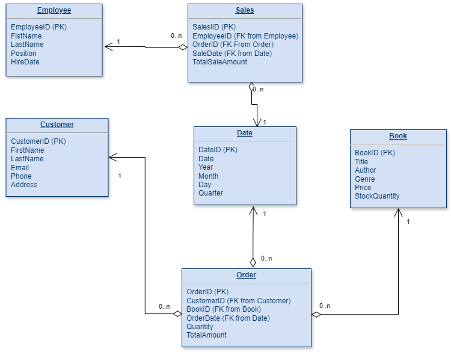
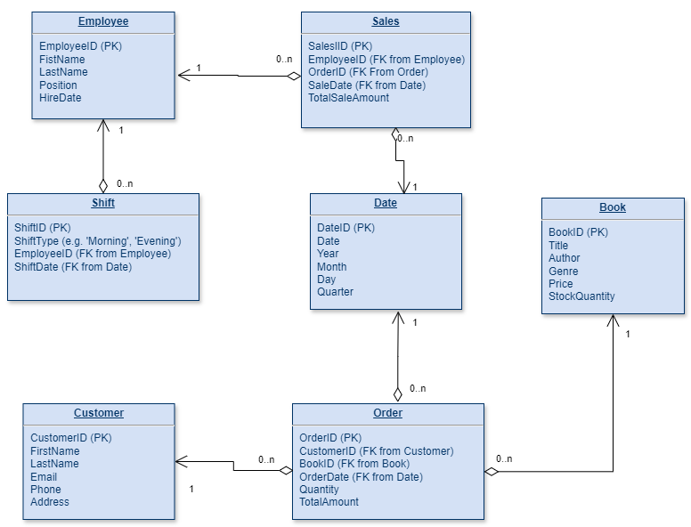
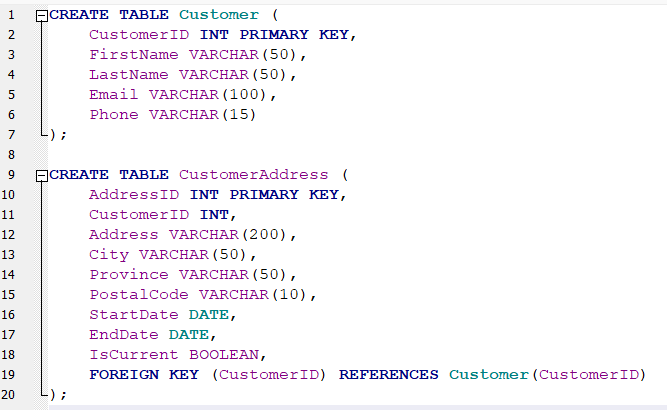
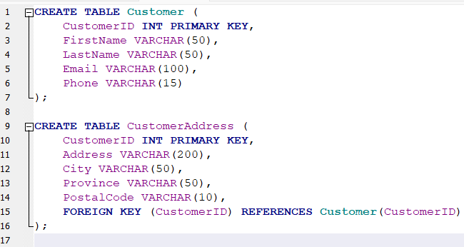

# Assignment 1: Design a Logical Model

## Question 1

Create a logical model for a small bookstore. 📚

At the minimum it should have employee, order, sales, customer, and book entities (tables). Determine sensible column and table design based on what you know about these concepts. Keep it simple, but work out sensible relationships to keep tables reasonably sized. Include a date table. There are several tools online you can use, I'd recommend [_Draw.io_](https://www.drawio.com/) or [_LucidChart_](https://www.lucidchart.com/pages/).

### Relationships

* An Employee can handle multiple Sales.
* A Customer can place multiple Orders.
* An Order can have multiple Books.
* A Book can be part of multiple Orders.
* Each Order and Sale is linked to a specific Date.

### SQL query to create tables

CREATE TABLE Employee (
    EmployeeID INT PRIMARY KEY,
    FirstName VARCHAR(50),
    LastName VARCHAR(50),
    Position VARCHAR(50),
    HireDate DATE
);

CREATE TABLE Customer (
    CustomerID INT PRIMARY KEY,
    FirstName VARCHAR(50),
    LastName VARCHAR(50),
    Email VARCHAR(100),
    Phone VARCHAR(15),
    Address VARCHAR(200)
);

CREATE TABLE Book (
    BookID INT PRIMARY KEY,
    Title VARCHAR(100),
    Author VARCHAR(100),
    Genre VARCHAR(50),
    Price DECIMAL(10, 2),
    StockQuantity INT
);

CREATE TABLE Date (
    DateID INT PRIMARY KEY,
    Date DATE,
    Year INT,
    Month INT,
    Day INT,
    Quarter INT
);

CREATE TABLE [Order] (
    OrderID INT PRIMARY KEY,
    CustomerID INT,
    OrderDate INT,
 BookID INT,
 Quantity INT,
    TotalAmount DECIMAL(10, 2),
    FOREIGN KEY (CustomerID) REFERENCES Customer(CustomerID),
    FOREIGN KEY (OrderDate) REFERENCES Date(DateID)
 FOREIGN KEY (BookID) REFERENCES Book(BookID)
);

CREATE TABLE Sales (
    SalesID INT PRIMARY KEY,
    EmployeeID INT,
    OrderID INT,
    SaleDate INT,
    TotalSaleAmount DECIMAL(10, 2),
    FOREIGN KEY (EmployeeID) REFERENCES Employee(EmployeeID),
    FOREIGN KEY (OrderID) REFERENCES [Order](OrderID),
    FOREIGN KEY (SaleDate) REFERENCES Date(DateID)
);

## Question 2

We want to create employee shifts, splitting up the day into morning and evening. Add this to the ERD.

### Relationships

* An Employee can handle multiple Sales.
* An Employee can have multiple Shifts.
* A Customer can place multiple Orders.
* An Order can have multiple Books.
* A Book can be part of multiple Orders.
* Each Order and Sale is linked to a specific Date.

### SQL query to create table Shift

CREATE TABLE Shift (
    ShiftID INT PRIMARY KEY,
    ShiftType VARCHAR(50),
    EmployeeID INT,
    ShiftDate INT,
    FOREIGN KEY (EmployeeID) REFERENCES Employee(EmployeeID),
    FOREIGN KEY (ShiftDate) REFERENCES Date(DateID)
);

## Question 3

The store wants to keep customer addresses. Propose two architectures for the CUSTOMER_ADDRESS table, one that will retain changes, and another that will overwrite. Which is type 1, which is type 2?

_Hint, search type 1 vs type 2 slowly changing dimensions._

Bonus: Are there privacy implications to this, why or why not?
Type 1 and Type 2

### Architecture 1: Retaining Changes

Type 1 (retain addresses): This method retains all historical data by adding a new row for each change. Each address change creates a new record with a different version or date range.

In this architecture, each address change creates a new row in the CustomerAddress table with StartDate, EndDate, and IsCurrent fields to track the validity period of each address.

### Architecture 2: Overwriting Changes

Type 2 (overwrite): This method overwrites old data with new data. Changes in customer addresses would be updated in place, and the previous address would be lost.

### Privacy Implications

#### Overwriting Changes

* Privacy Benefit: Overwriting old addresses can be beneficial for privacy since only the current address is retained.
* Privacy Concern: There might be less transparency or accountability in tracking historical address changes.

#### Retaining Changes

* Privacy Benefit: This method maintains a full history of address changes, which can be useful for auditing and accountability.
* Privacy Concern: Storing historical addresses can raise privacy issues, especially if the data is not adequately protected. Unauthorized access to historical addresses could lead to privacy breaches.

## Question 4

Review the AdventureWorks Schema [here](https://i.stack.imgur.com/LMu4W.gif)

Highlight at least two differences between it and your ERD. Would you change anything in yours?

* The AdventureWorks ERD has multiple business domains/schemas (Production, Person, Sales, Purchasing) which contain many related entities. The domains/schemas are coloured to hepl navigating this complex diagram.
* The AdventureWorks ERD does not indicate 1-many or 1-1 relationships between differnt entities.
* There is separate dbo schema for error and action loging. I think it is benefitial to have such monitoring in place.

# Criteria

[Assignment Rubric](./assignment_rubric.md)

# Submission Information

🚨 **Please review our [Assignment Submission Guide](https://github.com/UofT-DSI/onboarding/blob/main/onboarding_documents/submissions.md)** 🚨 for detailed instructions on how to format, branch, and submit your work. Following these guidelines is crucial for your submissions to be evaluated correctly.

### Submission Parameters

* Submission Due Date: `June 1, 2024`
* The branch name for your repo should be: `model-design`
* What to submit for this assignment:
  * This markdown (design_a_logical_model.md) should be populated.
  * Two Entity-Relationship Diagrams (preferably in a pdf, jpeg, png format).
* What the pull request link should look like for this assignment: `https://github.com/<your_github_username>/sql/pull/<pr_id>`
  * Open a private window in your browser. Copy and paste the link to your pull request into the address bar. Make sure you can see your pull request properly. This helps the technical facilitator and learning support staff review your submission easily.

Checklist:
* [ ] Create a branch called `model-design`.
* [ ] Ensure that the repository is public.
* [ ] Review [the PR description guidelines](https://github.com/UofT-DSI/onboarding/blob/main/onboarding_documents/submissions.md#guidelines-for-pull-request-descriptions) and adhere to them.
* [ ] Verify that the link is accessible in a private browser window.

If you encounter any difficulties or have questions, please don't hesitate to reach out to our team via our Slack at `#cohort-3-help`. Our Technical Facilitators and Learning Support staff are here to help you navigate any challenges.
