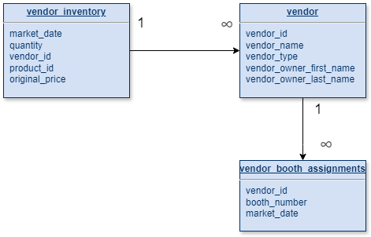

# Homework 1: Logical Data Model farmersmarket.db

#### Tables: 
- vendor_inventory
- vendor_id
- vendor_booth_assignment

#### Relationships
- vendor_inventory to vendor_id: one-to-many. Vendor inventory has information about intentory quantities on a specific event (market_date)
- vendor_id to vendor_booth_assignment: one-to-many. One vendor can have only multiple booth assignments.

